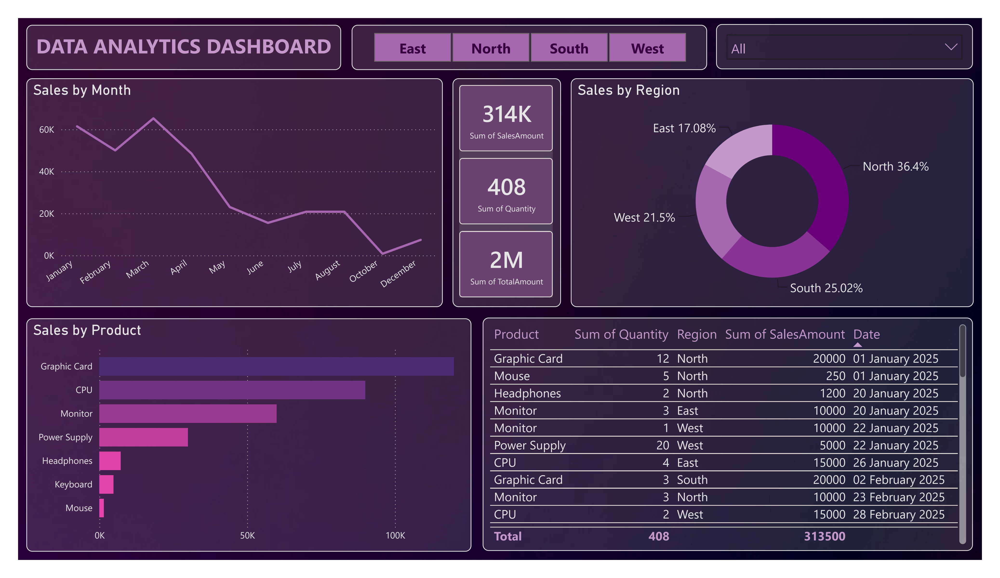

# Data Analytics Dashboard

## Overview

This project is an interactive Power BI dashboard designed to analyze sales performance, product trends, and regional sales distribution. The dashboard converts raw sales data into meaningful insights through interactive visualizations and filters.

## Key Features

* Sales by Month Analysis
* KPI Cards (Sales Amount, Quantity Sold, Total Amount)
* Sales Distribution by Region
* Product-wise Sales Analysis
* Detailed Transaction Table
* Region Filter
* Product Filter

## Dashboard Insights

### Sales by Month

Track sales performance across different months and identify trends over time.

### KPI Summary

* Total Sales Amount: 314K
* Total Quantity Sold: 408
* Total Amount: 2M

### Sales by Region

Analyze sales contribution across:

* North
* South
* East
* West

### Product Performance

Compare sales of products such as:

* Graphic Card
* CPU
* Monitor
* Power Supply
* Headphones
* Keyboard
* Mouse

## Tools Used

* Power BI
* DAX
* Data Modeling
* Power Query
* Data Visualization

## Dashboard Preview

## Project Files

* Task01.pbix
* Task01 Report.docx
* Task01.png

## Business Value

The dashboard helps users:

* Monitor sales performance
* Analyze regional sales distribution
* Compare product sales
* Track key business metrics
* Make data-driven decisions

## Author

Prathmesh D. Tamboli
